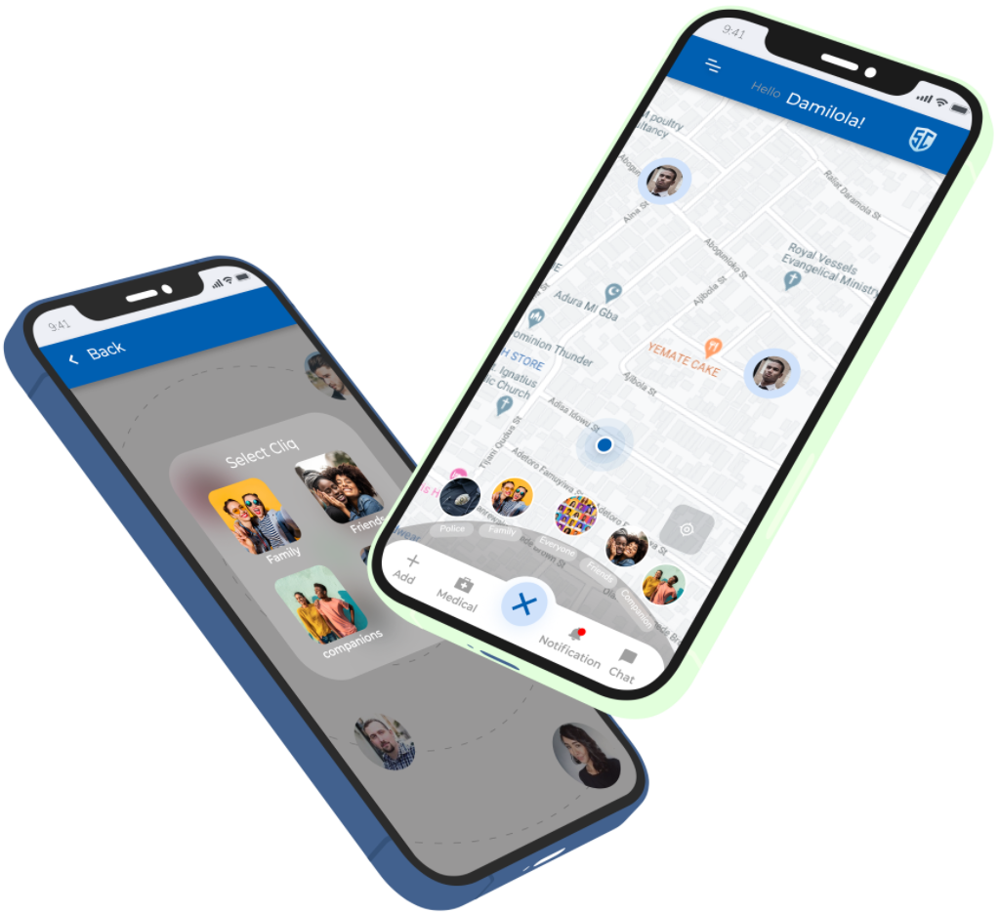
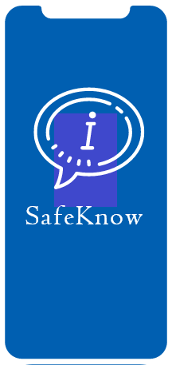
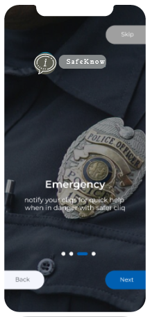
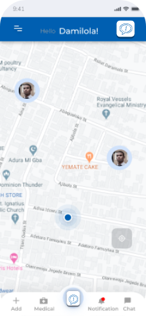

<!DOCTYPE html>
<html>
<head>
	<meta charset="utf-8">
	<meta name="viewport" content="width=device-width, initial-scale=1">
	<link rel="stylesheet" type="text/css" href="test1.css">
	<link rel="icon" href="picture/logo.png">
	<title>SafeKnow v1.1</title>
</head>
<body>
	<!-- navbar code -->
	

			
			<h3>SafeKnow</h3>
		
	
			<a href="#home">Home</a>
			<a href="#Subscribe">Subscribe</a>
			<a href="#About">About</a>
			<a href="#Contact_us">Contact Us</a>
		

		<button class="login">Login</button>
		<button class="join">Join Us</button>
	

	<!-- hero board codes -->
	

		

			<h2>Welcome  to <b>SafeKnow.</b></h2>
			
Lorem Ipsum dolor sit amet, consectetur adipiscing elit,
				sed do eiusmod tempor incididunt ut labore et dolore magna aliqua.
				Ut enim ad minim veniam, quis nostrud exercitation ullamco laboris nisi ut aliquip ex ea commodo consequat. 
			

			<button class="patner">Patner With Us</button>
		

		<!-- heropics code -->
		

			

			

			

			

			

			

			

		
	
	

	

		<h2>Follow these three steps and guarantee  your safety with Safercliq</h2>
		

			
<h3>Download</h3> <small>lorem Ipsum dolor sit amet, consectetur adipiscing elit</small>

			
<h3>Use App</h3> <small>lorem Ipsum dolor sit amet, consectetur adipiscing elit</small>

			
<h3>Secure</h3> <small>lorem Ipsum dolor sit amet, consectetur adipiscing elit</small>

		

	

	

		

			<h2>Problems</h2>
			
Lorem Ipsum dolor sit amet, consectetur adipiscing elit,
				sed do eiusmod tempor incididunt ut labore et dolore magna aliqua.
				Ut enim ad minim veniam, quis nostrud exercitation ullamco laboris nisi ut aliquip ex ea commodo consequat
			

		

		

			<h2>Solutions</h2>
			
Lorem Ipsum dolor sit amet, consectetur adipiscing elit,
				sed do eiusmod tempor incididunt ut labore et dolore magna aliqua.
				Ut enim ad minim veniam, quis nostrud exercitation ullamco laboris nisi ut aliquip ex ea commodo consequat
			

		

	

	

		<!-- empty -->
	

	

		

        

            

                
			<h4>Download Our New App</h4>
			

				<button>Apple Store</button>
				<button>Google Store</button>
			

			

				Lorem Ipsum dolor sit amet, consectetur adipiscing elit,
				sed do eiusmod tempor incididunt ut labore et dolore magna aliqua
			

            

        

	

	

		<h2 id="sc">Screenshot</h2>
		

			

				<h2>01 onboarding</h2>
				

					Lorem Ipsum dolor sit amet, consectetur adipiscing elit,
					sed do eiusmod tempor incididunt ut labore et dolore magna aliqua.
					Ut enim ad minim veniam, quis nostrud exercitation ullamco laboris nisi ut aliquip ex ea commodo consequat	
				

			

			

				
				
				
				
				
			

		

		

			

					
					
					
			

			

				<h2>02 Authentication</h2>
				

					Lorem Ipsum dolor sit amet, consectetur adipiscing elit,
					sed do eiusmod tempor incididunt ut labore et dolore magna aliqua.
					Ut enim ad minim veniam, quis nostrud exercitation ullamco laboris nisi ut aliquip ex ea commodo consequat	
				

			

		

		

			

				<h2>01 onboarding</h2>
				

					Lorem Ipsum dolor sit amet, consectetur adipiscing elit,
					sed do eiusmod tempor incididunt ut labore et dolore magna aliqua.
					Ut enim ad minim veniam, quis nostrud exercitation ullamco laboris nisi ut aliquip ex ea commodo consequat	
				

			

			

				
				
				
				
			

		

	

</body>
</html>
